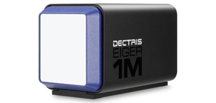

.. _camera-eiger:

DECTRIS EIGER
=============



Introduction
------------
| The EIGER 1M is a high performance X-Ray detector system.
| It is made of two subsystems: a detector and a control server.
| The control server is driven using an HTTP RESTful interface.
| A C++ API for LImA has been developed at Synchrotron SOLEIL.

Prerequisite
------------
Need to install some dependencies:

 - libcurl
 - liblz4
 - libzmq
 - libjsoncpp

On debian like system to install all dependencies, type this command:

.. code-block:: bash

  seb@pcbliss02:~$ sudo apt-get install libcurl4-gnutls-dev liblz4-dev libzmq3-dev libjsoncpp-dev

Installation and Module configuration
-------------------------------------

-  follow first the steps for the linux installation :ref:`linux_installation`

The minimum configuration file is *config.inc* :

.. code-block:: sh

  COMPILE_CORE=1
  COMPILE_SIMULATOR=0
  COMPILE_SPS_IMAGE=1
  COMPILE_ESPIA=0
  COMPILE_FRELON=0
  COMPILE_MAXIPIX=0
  COMPILE_PILATUS=0
  COMPILE_BASLER=0
  COMPILE_EIGER=1
  COMPILE_CBF_SAVING=0
  export COMPILE_CORE COMPILE_SPS_IMAGE COMPILE_SIMULATOR \
         COMPILE_ESPIA COMPILE_FRELON COMPILE_MAXIPIX COMPILE_PILATUS \
         COMPILE_BASLER COMPILE_ANDOR COMPILE_CBF_SAVING

-  start the compilation :ref:`linux_compilation`

-  finally for the Tango server installation :ref:`tango_installation`

Initialisation and Capabilities
--------------------------------

In order to help people to understand how the camera plugin has been implemented in LImA this section
provide some important information about the developer's choices.

Camera initialization
`````````````````````
Initialization is performed automatically within the Eigercamera object. By default the stream will be 
use to retrieved images unless hardware saving is activated (CtSaving::setManagedMode(CtSaving::Hardware))

Std capabilities
````````````````

* HwDetInfo

+------------------------+-------------+--------------+--------------+--------------+
| Capability             | 1M Value    | 4M Value     | 9M Value     | 16M Value    |
+========================+=============+==============+==============+==============+
| Maximum image size     | 1030 * 1065 | 2070 * 2167  | 3110 * 3269  | 4150 * 4371  | 
+------------------------+-------------+--------------+--------------+--------------+
| Pixel depth            | 12 bits     | 12 bits      | 12 bits      | 12 bits      |
+------------------------+-------------+--------------+--------------+--------------+
| Pixel size             | 75µm * 75µm | 75µm * 75µm  | 75µm * 75µm  | 75µm * 75µm  |
+------------------------+-------------+--------------+--------------+--------------+
| Maximum frame rate     | 3000Hz      | 750Hz        | 238Hz        | 133Hz        |
+------------------------+-------------+--------------+--------------+--------------+

* HwSync

Supported trigger types are:
 - IntTrig
 - IntTrigMult
 - ExtTrigSingle
 - ExtTrigMult
 - ExtGate
 
* There is no hardware support for binning or roi.
* There is no shutter control.

Optional capabilities
---------------------

* **Cooling**

 * The detector uses liquid cooling.
 * The API allows accessing the temperature and humidity as read-only values.

| At the moment, the specific device supports the control of the following features of the Eiger Dectris API.
| (Extended description can be found in the Eiger API user manual from Dectris).

* **Photon energy**: This should be set to the incoming beam energy.
  Actually it's an helper which set the threshold
* **Threshold energy**: This parameter will set the camera detection threshold.
  This should be set between 50 to 60 % of the incoming beam energy.
* **Auto Summation** (if activate image depth is 32 and, if not image depth is 16)
* **HwSaving**:
  This detector can directly generate hd5f, if this feature is used.
  Internally Lima control the file writer Eiger module.
  This capability can be activated though the control part with CtSaving object with setManagedMode method. 
* **Countrate correction**
* **Efficiency correction**
* **Flatfield correction**
* **LZ4 Compression**
* **Virtual pixel correction**
* **Pixelmask**

Configuration
-------------

* Device configuration

The default values of the following properties must be updated in the specific device to meet your system configuration.

+------------------------+---------------------------------------------------------------------------------------------------+----------------+
| Property name          | Description                                                                                       | Default value  | 
+========================+===================================================================================================+================+
| DetectorIP             | Defines the IP address of the Eiger control server (ex: 192.168.10.1)                             |      127.0.0.1 |
+------------------------+---------------------------------------------------------------------------------------------------+----------------+

How to use
-------------

This is a python code example for a simple test:

.. code-block:: python

  from Lima import Eiger
  from lima import Core

  #------------------+
  #                  |
  #                  v ip adress or hostname 
  cam = Eiger.Camera(lid32eiger1)

  hwint = Eiger.Interface(cam)
  ct = Core.CtControl(hwint)

  acq = ct.acquisition()

  # set hardware configuration
  # refer to the Dectris Eiger documentation for more information
  cam.setCountrateCorrection(False)
  cam.setFlatfieldCorrection(True)
  cam.setAutoSummation(False)
  cam.setEfficiencyCorrection(True)
  cam.setVirtualPixelCorrection(True)
  cam.setPixelMask(True)

  # read some parameters
  print (cam.getTemperature())
  print (cam.getHumidity())


  # set energy threshold in KeV
  cam.seThresholdEnery(16.0)
  cam.setPhotonEnergy(16.0)
  
  # setting new file parameters and autosaving mode
  saving=ct.saving()

  pars=saving.getParameters()
  pars.directory='/buffer/lcb18012/opisg/test_lima'
  pars.prefix='test1_'
  pars.suffix='.edf'
  pars.fileFormat=Core.CtSaving.EDF
  pars.savingMode=Core.CtSaving.AutoFrame
  saving.setParameters(pars)

  # set accumulation mode

  acq_pars= acq.getPars()

  # now ask for 10 msec exposure and 10 frames
  acq.setAcqExpoTime(0.01)
  acq.setNbImages(10) 
  
  ct.prepareAcq()
  ct.startAcq()

  # wait for last image (#9) ready
  lastimg = ct.getStatus().ImageCounters.LastImageReady
  while lastimg !=9:
    time.sleep(1)
    lastimg = ct.getStatus().ImageCounters.LastImageReady
 
  # read the first image
  im0 = ct.ReadImage(0)

