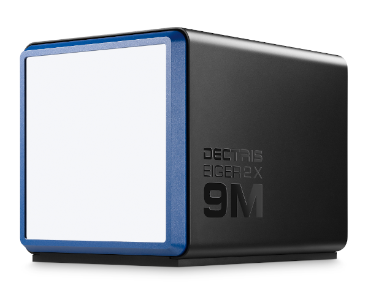

# Eiger simulator




![Pypi python versions][pypi-python-versions]
![Pypi version][pypi-version]
![Pypi status][pypi-status]
![License][license]

Dectris Eiger detector simulator.

For now simulates Eiger 9M at full ROI in internal trigger single mode (ints).

Complete HTTP REST API + ZMQ data stream.

## Installation

From within your favorite python environment:

```bash
$ pip install -e eiger-simulator
```

If you need the client library, you need in addition:

```bash
$ pip install -e eiger-simulator[client]
```

## Usage

Run simulator with:

```bash
$ eiger-simulator --dataset=<path to the HDF5 master file> --max-memory=1_000_000_000
```

This will start a simulator listening to the HTTP interface on port 8000 and the
ZMQ streaming socket on TCP port 9999

Run with `--help` to see the complete list of options

```bash
$ eiger-simulator --help
Usage: eiger-simulator [OPTIONS]

Options:
  --host TEXT                     Bind web socket to this host.  [default: 0]
  --port INTEGER                  Bind web socket to this port.  [default: 8000]
  --zmq TEXT                      Bind ZMQ socket  [default: tcp://*:9999]
  --dataset PATH                  dataset path or file
  --max-memory INTEGER            max memory (bytes)  [default: 1000000000]
  --log-level [critical|error|warning|info|debug|trace]
                                  Show only logs with priority LEVEL or above
                                  [default: info]
  --help                          Show this message and exit.
```

## Client

The client is accessible as a python library:

```python
>>> from eigersim.client import Eiger
>>> eiger = Eiger('http://127.0.0.1:8000')
>>> eiger.initialize()
[response 200]
>>> eiger.nimages
100
>>> eiger.count_time
0.1
>>> eiger.trigger_mode
'ints'
>>> eiger.arm()
[response 200]
>>> eiger.trigger()
[response 200]
```

Note that you should be able to use the client to connect to a real Eiger detector, not just
the simulated one.


For reference, here is a simple client that listens to the ZMQ stream:

```python
>>> import zmq
>>> ctx = zmq.Context()
>>> sock = ctx.socket(zmq.PULL)
>>> sock.connect('tcp://127.0.0.1:9999')
>>> while True:
      data = sock.recv_multipart()
      size = sum(len(i) for i in data)
      print(f'packet #parts={len(data)} size={size/1000} KB')
```

## Benchmarks

Benchmark results available [here](docs/benchmarks.md).


[pypi-python-versions]: https://img.shields.io/pypi/pyversions/eiger-simulator.svg
[pypi-version]: https://img.shields.io/pypi/v/eiger-simulator.svg
[pypi-status]: https://img.shields.io/pypi/status/eiger-simulator.svg
[license]: https://img.shields.io/pypi/l/eiger-simulator.svg
