# Benchmarks

### Hosts

#### ctsimdetector

* 8 CPU (Intel(R) Xeon(R) Gold 6136 CPU @ 3.00GHz)
  * hypervisor: Xen
  * caches: L1d: 32K, L1i: 32K, L2: 1024K, L3: 25344K
  * thread p/ core: 1, cores p/ socket: 1
* 8 GB RAM
* ETH 10Gb

#### ctsimingestion

* 8 CPU (Intel(R) Xeon(R) Gold 6136 CPU @ 3.00GHz)
  * hypervisor: Xen
  * caches: L1d: 32K, L1i: 32K, L2: 1024K, L3: 25344K
  * thread p/ core: 1, cores p/ socket: 1
* 32 GB RAM
* ETH 10Gb
* SSD hard drive on /dev/xvdb1

## 2020-02-26

* eiger-simulator
  *  git version: ff48f0
  * sample dataset from Eiger
  * sending LZ4 compressed images through ZMQ (lima does not support bitshuffle yet)
  * LZ4 image size is around 5.7MB

* lima-core 1.9.1 on conda with python 3.7
* lima-camera-eiger 1.9.3 with patch to support configurable http port

### Description

> No saving benchmark max. **sustained** speed between detector and lima.
> Variables: *nb processing tasks*; *exposure time*

The infrastructure is being shared with some course taking place at the same
time which requires some CPU & GPU resources.

### Commands

run `eiger-simulator` in **ctsimdetector** with:

```
eiger-simulator --max-memory=1_000_000_000 \
                --dataset=/home/sicilia/mx-datasets/EIGER_9M_datasets/transthyretin_200Hz/200Hz_0.1dpf_1_master.h5
```

(initializes 175 frames in memory)

run `eigersim/examples/lima.py` in **ctsimingestion** with:

```
python lima.py --url=10.24.24.4:8000 \
               --max-buffer-size=5 \
               --frame-type=Bpp16 \
               --nb-processing-tasks=$NB_PROCESSING \
               -n 10_000 \
               -e $EXPOSURE_TIME
```
* URL is forced with IP to ensure the 10Gb interface is used
* max buffer size is set 5% to ensure the acquisition can be sustained at least for 10k frames.

### Results

| # proc. tasks | Max. freq. | Flux |
| ---:| -------:| ---------:|
|  1  | 66.7 Hz |  280 MB/s |
|  2  |  140 Hz |  798 MB/s |
|  3  |  220 Hz | 1254 MB/s |
|  4  |  270 Hz | 1540 MB/s |

Higher frame rates bound by simulator maximum speed.

In a laptop the simulator behaved without overrun up to 600 Hz.

Further investigation needed to find why the simulator performace is not good
in ctsimdetector.


## 2020-03-09



* eiger-simulator
  *  git version: d1924d

Same test as 2020-02-26

### Description

> No saving benchmark max. **sustained** speed between detector and lima.
> Variables: *nb processing tasks*; *exposure time*

The infrastructure is dedicated to our tests.

### Results

| # proc. tasks | Max. freq. | Flux |
| ---:| -------:| ---------:|
|  1  | 66.7 Hz |  280 MB/s |
|  2  |  140 Hz |  798 MB/s |
|  3  |  220 Hz | 1254 MB/s |
|  4  |  270 Hz | 1540 MB/s |
|  5  |  333 Hz | 1900 MB/s |
|  6  |  370 Hz | 2109 MB/s |

At 370 Hz (~2109 MB/s) we hit the network barrier (see below the iperf test results)

#### IPerf

* server running on **ctsimingestion**
  * `iperf3 -p 5000 -B 10.24.24.5 -s -i 1`
* client running on **ctsimdetector**
  * `iperf3 -p 5000 -c 10.24.24.5 -t 30 -P 1 -i 1`

Server output:
```
Server listening on 5000
-----------------------------------------------------------
Accepted connection from 10.24.24.4, port 45878
[  5] local 10.24.24.5 port 5000 connected to 10.24.24.4 port 45880
[ ID] Interval           Transfer     Bandwidth
[  5]   0.00-2.00   sec  4.28 GBytes  18.4 Gbits/sec
[  5]   2.00-4.00   sec  4.42 GBytes  19.0 Gbits/sec
[  5]   4.00-6.00   sec  4.42 GBytes  19.0 Gbits/sec
[  5]   6.00-8.00   sec  4.49 GBytes  19.3 Gbits/sec
[  5]   8.00-10.00  sec  4.49 GBytes  19.3 Gbits/sec
[  5]  10.00-12.00  sec  4.42 GBytes  19.0 Gbits/sec
[  5]  12.00-14.00  sec  4.44 GBytes  19.1 Gbits/sec
[  5]  14.00-16.00  sec  4.44 GBytes  19.1 Gbits/sec
[  5]  16.00-18.00  sec  4.48 GBytes  19.3 Gbits/sec
[  5]  18.00-20.00  sec  4.39 GBytes  18.9 Gbits/sec
[  5]  20.00-22.00  sec  4.44 GBytes  19.1 Gbits/sec
[  5]  22.00-24.00  sec  4.45 GBytes  19.1 Gbits/sec
[  5]  24.00-26.00  sec  4.46 GBytes  19.2 Gbits/sec
[  5]  26.00-28.00  sec  4.46 GBytes  19.2 Gbits/sec
[  5]  28.00-30.00  sec  4.45 GBytes  19.1 Gbits/sec
[  5]  30.00-30.04  sec  90.6 MBytes  19.5 Gbits/sec
- - - - - - - - - - - - - - - - - - - - - - - - -
[ ID] Interval           Transfer     Bandwidth
[  5]   0.00-30.04  sec  0.00 Bytes  0.00 bits/sec                  sender
[  5]   0.00-30.04  sec  66.6 GBytes  19.1 Gbits/sec                  receiver
```

Client output:
```
Connecting to host 10.24.24.5, port 5000
[  4] local 10.24.24.4 port 45880 connected to 10.24.24.5 port 5000
[ ID] Interval           Transfer     Bandwidth       Retr  Cwnd
[  4]   0.00-1.00   sec  2.16 GBytes  18.6 Gbits/sec    1    728 KBytes
[  4]   1.00-2.00   sec  2.20 GBytes  18.9 Gbits/sec    0    738 KBytes
[  4]   2.00-3.00   sec  2.21 GBytes  19.0 Gbits/sec    0    748 KBytes
[  4]   3.00-4.00   sec  2.21 GBytes  19.0 Gbits/sec    0    755 KBytes
[  4]   4.00-5.00   sec  2.21 GBytes  19.0 Gbits/sec    0    810 KBytes
[  4]   5.00-6.00   sec  2.22 GBytes  19.0 Gbits/sec    0    820 KBytes
[  4]   6.00-7.00   sec  2.23 GBytes  19.2 Gbits/sec    0    827 KBytes
[  4]   7.00-8.00   sec  2.26 GBytes  19.4 Gbits/sec    0    928 KBytes
[  4]   8.00-9.00   sec  2.24 GBytes  19.2 Gbits/sec    0   1.05 MBytes
[  4]   9.00-10.00  sec  2.26 GBytes  19.4 Gbits/sec    0   1.05 MBytes
[  4]  10.00-11.00  sec  2.20 GBytes  18.9 Gbits/sec    0   1.05 MBytes
[  4]  11.00-12.00  sec  2.22 GBytes  19.1 Gbits/sec    0   1.05 MBytes
[  4]  12.00-13.00  sec  2.21 GBytes  19.0 Gbits/sec    0   1.05 MBytes
[  4]  13.00-14.00  sec  2.22 GBytes  19.1 Gbits/sec    0   1.05 MBytes
[  4]  14.00-15.00  sec  2.22 GBytes  19.1 Gbits/sec    0   1.05 MBytes
[  4]  15.00-16.00  sec  2.22 GBytes  19.1 Gbits/sec    0   1.05 MBytes
[  4]  16.00-17.00  sec  2.24 GBytes  19.2 Gbits/sec    0   1.05 MBytes
[  4]  17.00-18.00  sec  2.24 GBytes  19.3 Gbits/sec    0   1.05 MBytes
[  4]  18.00-19.00  sec  2.18 GBytes  18.7 Gbits/sec    0   1.05 MBytes
[  4]  19.00-20.00  sec  2.21 GBytes  19.0 Gbits/sec    0   1.05 MBytes
[  4]  20.00-21.00  sec  2.21 GBytes  19.0 Gbits/sec    0   1.05 MBytes
[  4]  21.00-22.00  sec  2.23 GBytes  19.2 Gbits/sec    0   1.05 MBytes
[  4]  22.00-23.00  sec  2.21 GBytes  19.0 Gbits/sec    0   1.05 MBytes
[  4]  23.00-24.00  sec  2.24 GBytes  19.2 Gbits/sec    0   1.05 MBytes
[  4]  24.00-25.00  sec  2.22 GBytes  19.1 Gbits/sec    0   1.05 MBytes
[  4]  25.00-26.00  sec  2.24 GBytes  19.2 Gbits/sec    0   1.05 MBytes
[  4]  26.00-27.00  sec  2.22 GBytes  19.1 Gbits/sec    0   1.05 MBytes
[  4]  27.00-28.00  sec  2.24 GBytes  19.2 Gbits/sec    0   1.05 MBytes
[  4]  28.00-29.00  sec  2.23 GBytes  19.2 Gbits/sec    0   1.05 MBytes
[  4]  29.00-30.00  sec  2.22 GBytes  19.1 Gbits/sec    0   1.05 MBytes
- - - - - - - - - - - - - - - - - - - - - - - - -
[ ID] Interval           Transfer     Bandwidth       Retr
[  4]   0.00-30.00  sec  66.6 GBytes  19.1 Gbits/sec    1             sender
[  4]   0.00-30.00  sec  66.6 GBytes  19.1 Gbits/sec                  receiver

iperf Done.
```

Trying to paralize the client (`-P <N>`) yield the same results.

